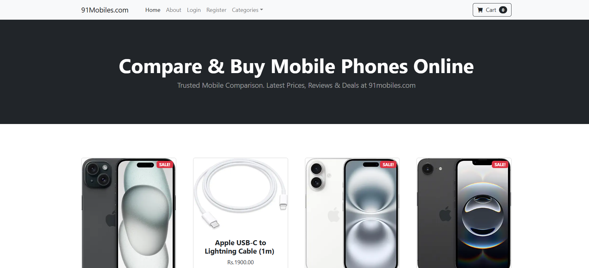
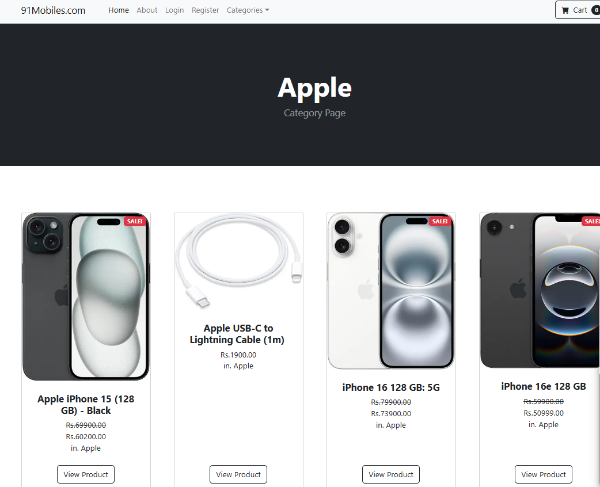
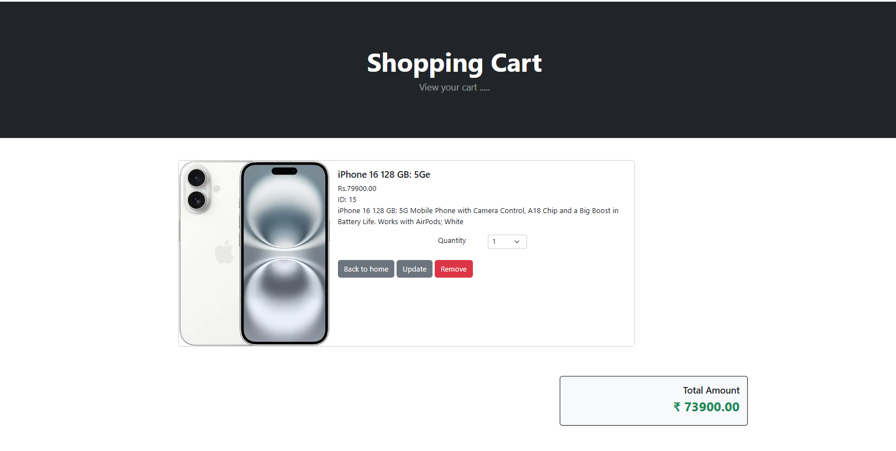
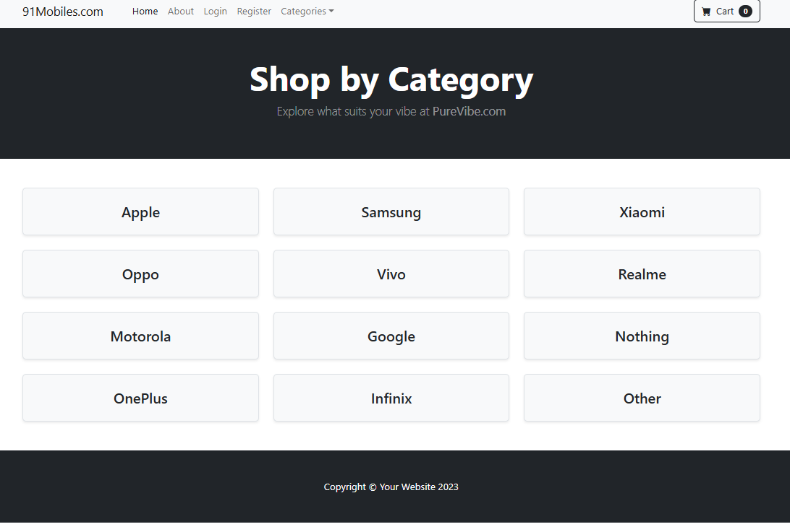
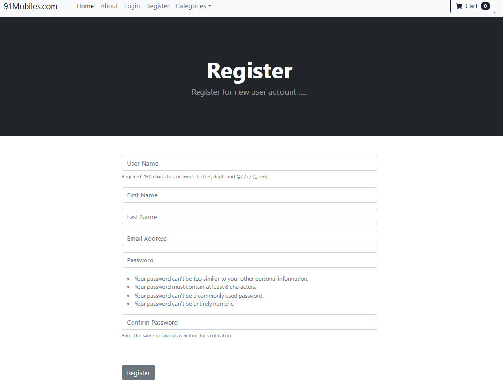

# 📱 Mobile E-Commerce Website - 91Mobiles Clone

This is a Django-based e-commerce website project designed to simulate a mobile shopping platform like 91Mobiles. It allows users to register, browse phones by category, add products to the cart, and manage profiles.

---

## 🔥 Features

- User registration & login
- Product listing and sale price display
- Add to cart (AJAX enabled)
- Category filter
- Admin management
- Profile update
- Django messages and Bootstrap UI

---

## 🖼️ Screenshots

### 🏠 Home Page


### 📱 Product Detail


### 🛒 Cart Page


### other Screenshot



## 🛠️ Tech Stack

- **Backend**: Django, Python
- **Frontend**: HTML, CSS, Bootstrap, jQuery
- **Database**: SQLite
- **Authentication**: Django built-in auth system
- **Static files**: Managed using Django's static system

---

## 🚀 Setup Instructions
  bash
- python -m venv env
- source env/bin/activate  # On Windows use: env\Scripts\activate
- pip install -r requirements.txt
- python manage.py migrate
- python manage.py createsuperuser
- python manage.py runserver
- Visit http://127.0.0.1:8000 in your browser.


### 1. Clone the repository

```bash
git clone https://github.com/your-username/your-repo-name.git
cd your-repo-name
